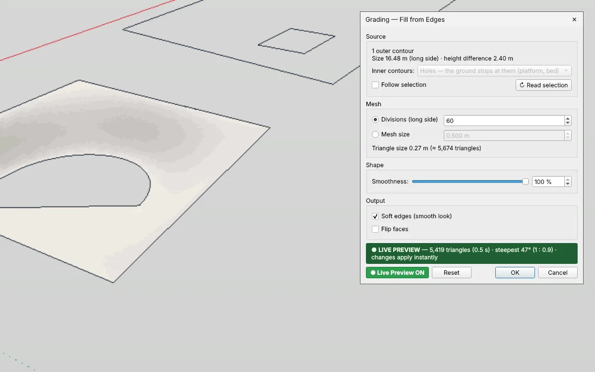

# Grading — fill open ground with smooth terrain for IngeTrazo

Fills the open ground between edges — a path, a terrace, a ramp, a sunken plaza — with **smooth, organic terrain** that meets every edge exactly, like ground laid out by hand. The edges may lie at different heights.

[Deutsch → LIESMICH.md](LIESMICH.md)

## Installation
1. In IngeTrazo: **Extensions ▸ Open plugins folder** (Windows: `%APPDATA%\ingetrazo\plugins\`, Linux: `~/.local/share/ingetrazo/plugins/`).
2. Copy `grading_tool.py` into that folder.
3. Restart IngeTrazo → **Extensions ▸ Grading ▸** *Fill from Edges… · Edit Grading…* (also on the right-click menu).

Requires IngeTrazo ≥ 0.5 (extension API 2). A sample model is in [`examples/grading_examples.igz`](examples/grading_examples.igz).

## How to use
Select the edges around the open ground (loose edges and/or groups of edges) and run **Fill from Edges…**.

- The **largest closed loop** (seen from above) is the outer contour. Closed loops inside it are inner contours: **Holes** (a platform or a bed the ground stops at) or **Fixed lines** (the ground runs on past them).
- **Open edge chains** inside are fixed lines (a swale, a ridge); selected **guide points** (Tape Measure) are spot heights.
- **Smoothness** — 100 % lets the ground run out level from every edge and rounds the top and toe of each slope; 0 % gives straight slopes with a crease at the edges.
- **Divisions / Mesh size** set the density of the triangle mesh; the dialog shows the triangle count and the **steepest slope** (° and 1 : n).
- **Live Preview** shows the terrain in the model while the dialog stays open (the viewport can still be orbited); **OK** keeps the current preview without recalculating.
- The result is **one group** that remembers its edges and settings — select it and run **Edit Grading…** to change it. One undo step per run.

## Changelog
- **1.1** — own toolbar **Grading** with one icon per command (Fill from Edges… · Edit Grading…). It starts on a row of its own under the built-in toolbars; move, float or hide it like those (right-click on a toolbar). Icons drawn in IngeTrazo's own style, they follow the light/dark theme.
- **1.0** — first release.

## Licence
GPL-3.0-or-later · © 2026 Pesi (pesi3d.de) · [Impressum](https://pesi3d.de)
